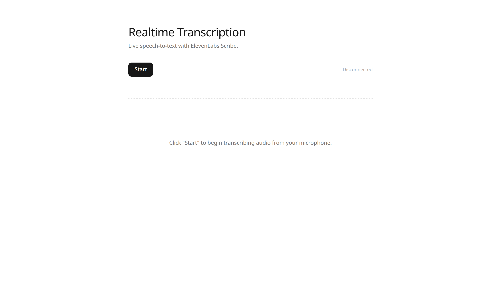
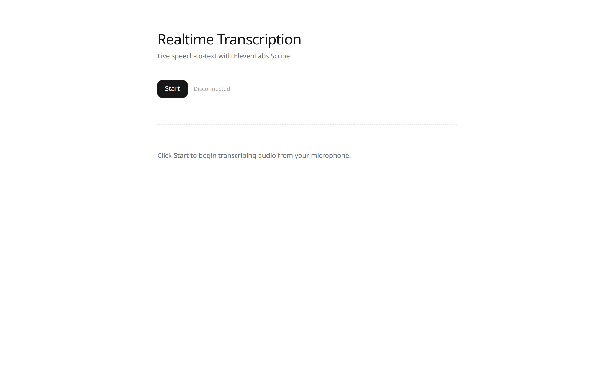
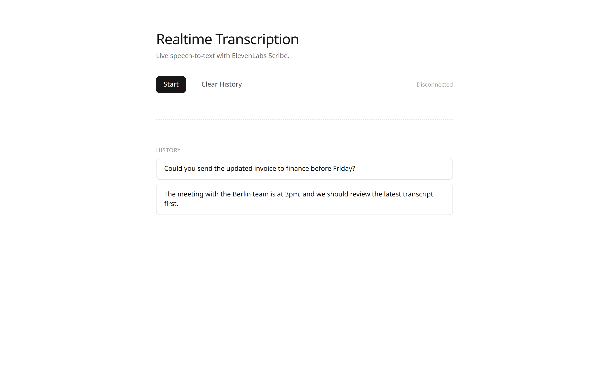
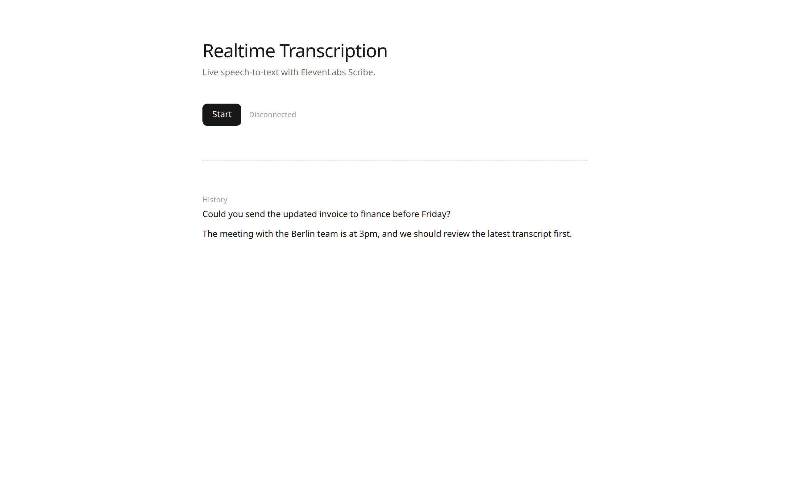
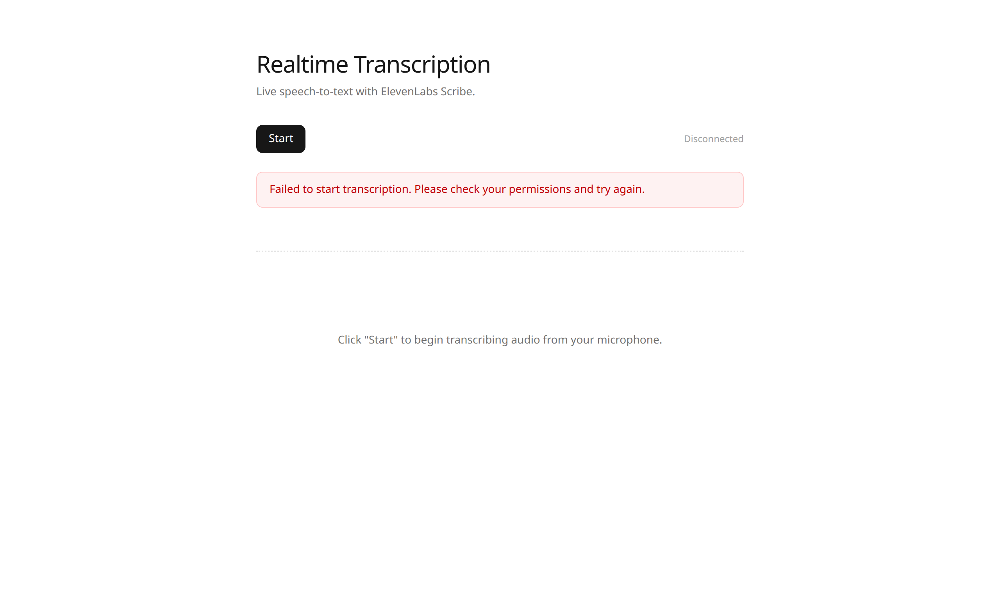
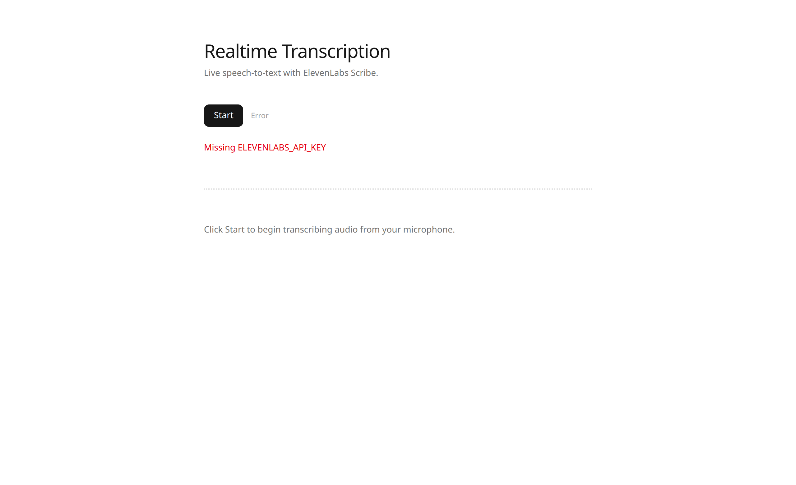
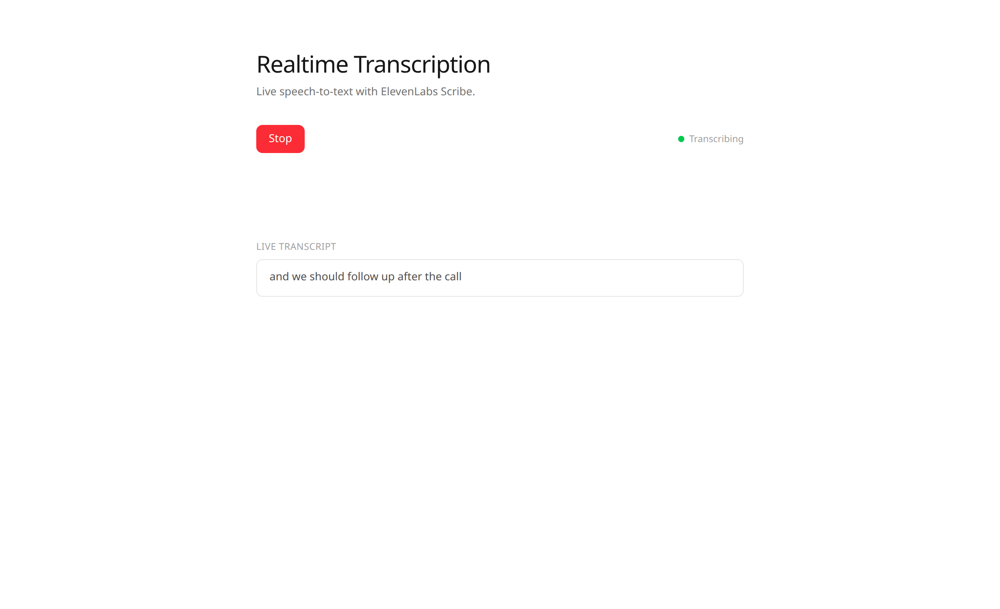
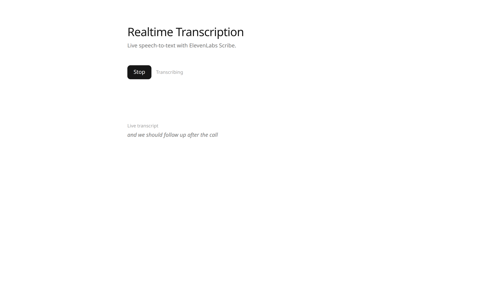

# STT realtime UI before vs after

Rendered from `speech-to-text/nextjs/realtime` using the page markup on `main` (before) and this PR (after). History, error, and listening states use the same sample data.

Review-only. Drop this folder before merge if you do not want screenshots in the repo.

## Idle

**Before** — status is right-aligned; hint is centered.

**After** — status sits next to Start; hint is left-aligned and tighter.

## History

**Before** — Clear History button, uppercase HISTORY label, each line in a bordered card.

**After** — no Clear History; history is plain text.

## Error

**Before** — generic permission message in a red box.

**After** — status can read Error; API error text is shown inline.

## Listening

**Before** — red Stop button, green status dot, boxed live transcript.

**After** — same black button for Start/Stop; live transcript is italic, no box.

